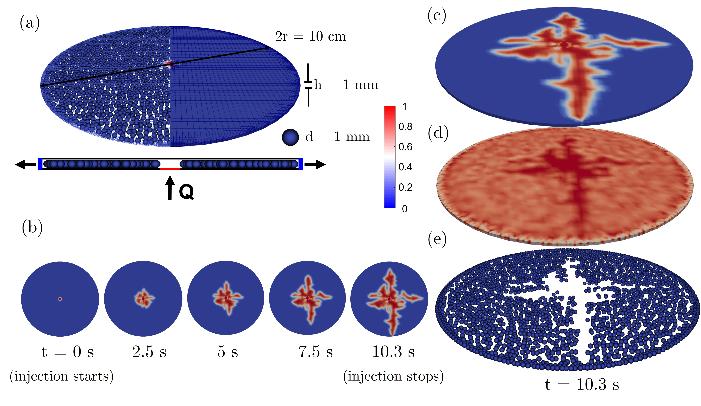
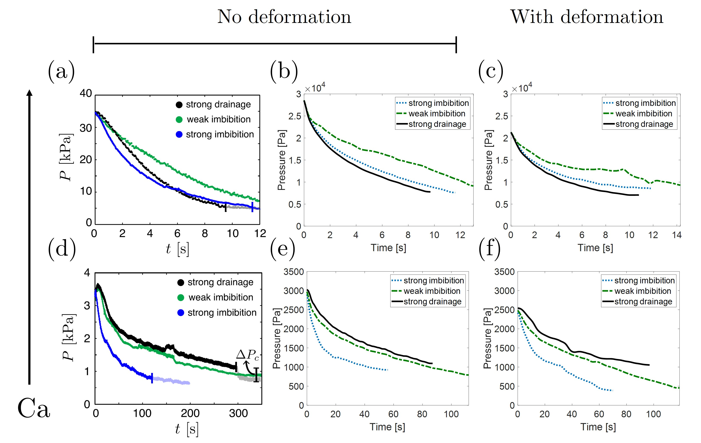

# VOF-DEM Solvers

This repository provides implementations of coupled Volume of Fluid (VOF) and Discrete Element Method (DEM) solvers for simulating multiphase flows with unresolved CFD-DEM methodology, where fluid cells are larger than individual particles. The solvers are developed within the [CFDEMproject](https://github.com/CFDEMproject/CFDEMcoupling-PUBLIC) framework and are suitable for advanced micromechanical modeling of fluid-particle systems.

## Overview

- **cfdem_interDyMFoam**: Solver using the PISO algorithm for transient incompressible flow with CFD-DEM coupling.
- **cfdem_interDyMFoamPIMPLE_5x**: Solver using the PIMPLE algorithm for enhanced stability and flexibility in time-stepping.

Both solvers integrate VOF for interface capturing and DEM for particle dynamics, enabling detailed studies of fluid-particle interactions in unresolved regimes.

## Key Features

- **Unresolved CFD-DEM Coupling**: Fluid mesh is coarser than particle scale, allowing efficient simulation of large systems.
- **VOF Interface Tracking**: Accurate modeling of multiphase interfaces.
- **Flexible Turbulence Modeling**: Supports laminar, RAS, and LES turbulence models.
- **Micromechanical Analysis**: Designed for single-cycle and transient simulations, including injection and displacement scenarios.
- **Validation and Benchmarking**: Includes comparison with experimental data for injection pressure evolution.

## Publications

For detailed methodology and validation, see:  
[Phys. Rev. E 102, 013301 (2020)](https://journals.aps.org/pre/abstract/10.1103/PhysRevE.102.013301)

## Repository Structure

- `cfdem_interDyMFoam/`  
  PISO-based solver source code and configuration files.
- `cfdem_interDyMFoamPIMPLE_5x/`  
  PIMPLE-based solver source code and configuration files.
- `figures/`  
  Reference figures.
- `README.md`  
  Project documentation.
- `Paper.pdf`  
  Reference publication.

## Example Workflow

### 1. Setup

The computational domain consists of solid particles and an unresolved CFD mesh.  
  
*FIG. 2: Domain setup and volume fraction snapshots for injected fluid.*

### 2. Simulation

- Configure case files and parameters as per your scenario.
- Run the solver (`cfdem_interDyMFoam` or `cfdem_interDyMFoamPIMPLE_5x`) using OpenFOAM utilities.
- Analyze results for volume fraction, void fraction, particle positions, and injection pressure.

### 3. Validation

Comparison with experimental data is provided for injection pressure evolution:  
  
*FIG. 3: Experimental vs. computational results for injection pressure.*
